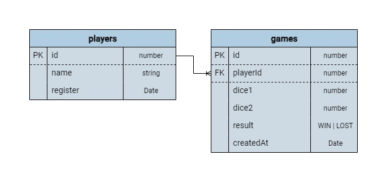

# API Juego de Dados

Bienvenido al repositorio de la API para el <span style="color:blue; font-size:24px">Juego de Dados</span>, un proyecto emocionante que se encuentra actualmente en pleno desarrollo. Esta API está diseñada para proporcionar una experiencia de juego interactiva y dinámica, permitiendo a los usuarios jugar a un clásico juego de dados de manera virtual.

## Estado del Proyecto
Este proyecto está en fase de <span style="color:red">desarrollo activo</span>. Estamos trabajando para implementar las funcionalidades y mejorar la experiencia general del usuario. Como tal, es importante tener en cuenta que algunas características pueden no estar completamente pulidas o pueden estar sujetas a cambios.

## Objetivos del Proyecto
- <span style="font-size:18px">Profundizar en el desarrollo del servidor de backend.</span>
- <span style="font-size:18px">Creación y acceso a bases de datos.</span>
- <span style="font-size:18px">Autenticación por Token.</span>
  
## Reglas del Juego
- Se juega con dos dados de seis caras.
- Si el resultado de los dos dados es 7, la partida se gana. Si no, se pierde.
- Para jugar, es necesario registrarse como jugador/a con un nombre.
- Un jugador/a puede ver un listado de todas las tiradas que ha hecho y su porcentaje de éxito.
- Si el usuario/a lo desea, puede no añadir ningún nombre y se llamará "ANÓNIMO". Puede haber más de un jugador/a "ANÓNIMO".
- Un jugador/a puede ver un listado de todas las tiradas que ha hecho con el valor de cada dado y si ha ganado o no la partida.
- No se puede eliminar una partida en concreto, pero sí todo el listado de tiradas de un jugador/a.
- El software permite listar todos los jugadores/as en el sistema, el porcentaje de éxito de cada uno y el porcentaje de éxito medio de todos los jugadores/as.
  
## Endpoints de la API

### Jugadores

- **POST /players:** Crea un jugador/a.
- **PUT /players/{id}:** Modifica el nombre de un jugador/a.
- **GET /players:** Devuelve el listado de todos los jugadores/as del sistema con su porcentaje de éxitos.

### Juegos

- **POST /games/{id}:** Un jugador/a específico realiza una tirada.
- **DELETE /games/{id}:** Elimina las tiradas del jugador/a.
- **GET /games/{id}:** Devuelve el listado de jugadas por un jugador/a.

### Ranking

- **GET /ranking:** Devuelve un ranking de jugadores/as ordenado por porcentaje de éxitos y el porcentaje de éxitos medio del conjunto de todos los jugadores/as.
- **GET /ranking/loser:** Devuelve el jugador/a con peor porcentaje de éxito.
- **GET /ranking/winner:** Devuelve el jugador/a con mejor porcentaje de éxito.


## Tecnologías Utilizadas

Este proyecto utiliza una variedad de tecnologías modernas para su desarrollo, incluyendo:

- **Node.js:** Como entorno de ejecución para JavaScript en el servidor.
- **TypeScript:** Para añadir tipado estático al código y mejorar la calidad del desarrollo.
- **Jest:** Para pruebas unitarias y asegurar la calidad del código.
- **Prettier:** Para mantener un estilo de código consistente.
- **Sequelize:** ORM para la gestión de la base de datos MySQL.
- **Docker:** Para la creación de instancias de bases de datos y contenedorización de la aplicación.


## Instalación y Uso

Para obtener una copia local en funcionamiento, sigue estos pasos:

1. Clona el repositorio.
2. Instala las dependencias con `npm install`.
3. Configura las variables de entorno según el archivo `.env`.
4. Construye y levanta los contenedores de Docker con `docker-compose up --build`.
5. Ejecuta el entorno de desarrollo con `npm run dev`.
   

### Manejo de Docker

Si necesitas limpiar y reiniciar el entorno de Docker, puedes seguir estos pasos:

1. Para bajar los contenedores:
    ```sh
    docker compose down
    ```

2. Para eliminar todos los volúmenes de Docker:
    ```sh
    docker volume rm $(docker volume ls -q)
    ```

3. Para eliminar todas las imágenes de Docker:
    ```sh
    docker rmi $(docker images -aq)
    ```

4. Para levantar los contenedores nuevamente:
    ```sh
    docker compose up
    ```

## Documentación de la API

Es importante documentar la API de manera clara y concisa. Aquí se incluye información sobre las rutas, los parámetros y las respuestas esperadas. Se recomienda utilizar plataformas como Postman o Insomnia para realizar y documentar las comprobaciones.


## Diagrama de Estructura de la Base de Datos




## Testing

Se han añadido pruebas para comprobar el correcto funcionamiento de la aplicación. Utiliza `npm test` para ejecutar las pruebas unitarias.

## Integración Continua

Se ha implementado CI (Integración Continua) con GitHub Actions para asegurar que todos los cambios en el repositorio cumplen con los estándares de calidad establecidos.

## Licencia

Este proyecto está bajo la Licencia ISC. Vea el archivo LICENSE para más detalles.


